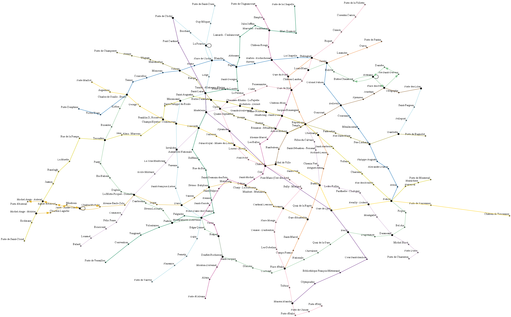
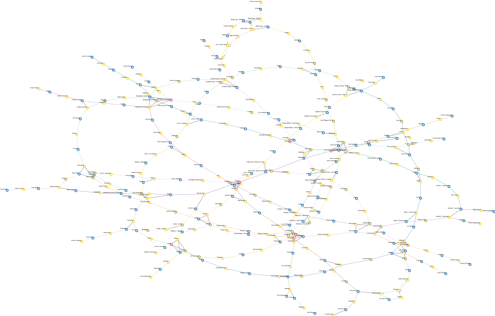
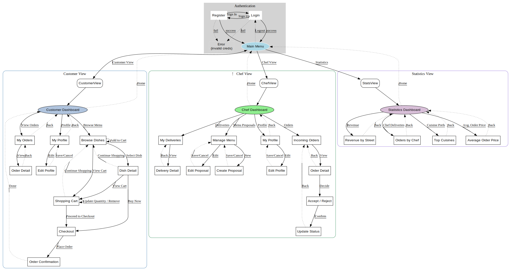

# Liv'In Paris

Bienvenue dans le projet **LivInParis**, une plateforme de livraison de repas dans Paris intra muros.

## 👥 Nous

Captainbleu (Austin) : Eliott Roussille

proxy-1 : François Teynier

## Démarrage rapide - Docker Desktop

### Prérequis

Assurez-vous d’avoir installé :

- [Docker](https://www.docker.com/products/docker-desktop/)
- [Docker Compose](https://docs.docker.com/compose/install/) (souvent inclus avec Docker Desktop)

Ou avec :

```bash
winget install -e --id Docker.DockerDesktop
```

---

#### 1. Cloner le dépôt

```bash
git clone https://github.com/Captainbleu/LivInParis.git
cd .\LivInParis\
```

#### 2. Démarrer les conteneurs

```bash
docker compose up -d --build
dotnet run --project src/LivinParis.Api
cd frontend
npm install
npm start
```

---

### 🧹 Arrêter et nettoyer

```bash
docker compose down
```

Ajoutez `--volumes` si vous souhaitez supprimer les volumes :

```bash
docker compose down --volumes
```

---

## Architecture logicielle

L’application repose sur une architecture modulaire très segmentée :

- `Domain` pour tous les objets, Models.
- `Infrastructure` pour la gestion de la base de données, des repositories et de l’ORM.
- `Services` pour la logique métier et les DTOs.
- `Controllers` pour les API REST.
- `frontend` pour l’interface utilisateur.
- Déploiement conteneurisé via Docker pour permettre la clonabilité du repo.

---

## Modélisation des graphes

Un graphe générique `Graph<T>` a été implémenté, permettant de traiter aussi bien les stations de métro que les string ou les relations entre comptes (clients et cuisiniers). Cette structure repose sur des collections fortement typées et ordonnées :

- `SortedSet<Node<T>> _nodes`
- `List<Edge<T>> _edges`
- `SortedDictionary<Node<T>, SortedDictionary<Node<T>, double>> _adjacencyList`
- `double[,] _adjacencyMatrix`
- `SortedDictionary<Node<T>, int> _nodeIndexMap`
- `double[,] _distanceMatrix`

Plusieurs propriétés du graphe sont automatiquement dérivées :

- Connexité, cyclicité, planéité, bipartisme
- Ordre, taille, poids total, densité, diamètre
- Pondération et orientation

De plus toutes les méthodes prenant en paramètre des `Node<T>` sont définies avec un `typeparam` `TU` pour permettre une grande flexibilité de paramétrage. Ainsi, grâce à la méthode `Node<T> ResolveNode<TU>` les méthodes supportent aussi bien des paramètres de type `int`, `Node<T>` ou `T`.

Nous avons également implémenté des algorithmes de recherche de cycles et de composantes fortement connexes renvoyant des listes de sous-graphes.

---

## Fonctionnalités de visualisation

Une couche de visualisation a été développée pour représenter les graphes. Ce sont les `Node<T>` qui sont paramétrés via un objet `VisualizationParameter`. Le programme exporte ensuite le graphe sous un format de fichier `.dot` puis fait appel à Graphviz pour générer une image.

On peut afficher le graphe, le graphe des plus courts chemins depuis un noeud, les sous graphes fortement connexes et la coloration du graphe.







---

## Optimisation du graphe

### Initialisation

Pour initialiser le graphe du métro parisien nous pouvions utiliser le fichier `MetroParis.xlsx` fourni dans le projet en le convertissant en une structure de données adaptée. Nous avions le choix entre utiliser une matrice ou une liste d'adjacence.

Pour choisir entre ces deux structures, nous avons testé les deux en chargeant le graphe du métro parisien et en mesurant le temps d'exécution moyen sur 20 itérations. Nous avons obtenu ces résultats :

|       Méthode       | Temps (ms) |
|---------------------|------------|
| Matrice d'adjacence | 11         |
| Liste d'adjacence   | 23         |

Nous avons donc choisi d'utiliser la matrice d'adjacence pour sa rapidité d'initialisation.

### Pathfinding

Trois algorithmes de plus courts chemins sont implémentés :

- Dijkstra (graphe pondéré à poids positifs)
- Bellman-Ford (gestion des poids négatifs)
- Floyd-Warshall (calcul de toutes les paires)

Ils peuvent retourner au choix un chemin (`List<Node<T>>`) ou un sous-graphe `Graph<T>`, ce qui permet d’adapter la demande au contexte.

Pour les comparer nous avons mesuré le temps d'exécution moyen en prenant comme point de départ chacune des 330 stations du métro parisien. Nous avons ensuite calculé le temps d'exécution moyen pour chaque algorithme. Voici les résultats obtenus :

|     Algorithme     | Temps (ms) |
|--------------------|------------|
| Dijkstra           | 5          |
| Bellman-Ford       | 4          |
| Roy-Floyd-Warshall | 198        |

Pour une meilleure comparaison, nous avons également mesuré les temps total d'exécution de Dijkstra et de Bellman-Ford sur l'ensemble du graphe. Voici les résultats obtenus :

|     Algorithme     | Temps (ms) |
|--------------------|------------|
| Dijkstra           | 1542       |
| Bellman-Ford       | 1429       |

Donc nous pouvons dans un but d'optimisation soit calculer la `pathMatrix` avec l'algorithme de Roy-Floyd-Warshall dès l'initialisation du graphe, soit la calculer à la demande avec l'algorithme de Bellman-Ford. Nous avons choisi de la calculer à la demande avec l'algorithme de Bellman-Ford car cela permet de ne pas surcharger la mémoire avec une matrice de 330x330 et de ne pas avoir à recalculer la matrice à chaque fois que le graphe est modifié si nous décidons d'intégrer les perturbations du réseau en temps réel plus tard.

---

## Intégration géographique

Une API est appelée pour convertir une adresse en coordonnées géographiques, puis identifier la station de métro la plus proche via la formule de Haversine.

De plus, pour éviter que le trajet commence ou finisse par une correspondance, le trajet d'une station a à b est calculé en prenant la correspondance optimale de la station de départ comme point de départ et celle de la station d'arrivée comme point d'arrivée. Par exemple le trajet `Charles de Gaulle - Etoile (6)` à `Nation (6)` est calculé en prenant la correspondance de `Charles de Gaulle - Etoile (1)` à `Nation (1)` comme point de départ et d'arrivée.

---

## Base de données

La base MySQL respecte les formes normales d’un modèle relationnel.

Le couplage C# ↔ SQL se fait via une couche ORM, assurant un contrôle explicite sur les requêtes tout en encapsulant la logique d’accès via des repositories typés.

Les données peuvent être exportées/importées au format JSON et XML, assurant leur réutilisabilité.

Des requêtes SQL complexes ont été implémentées par exemple :

- `GetDeliveryCountValueByChefAsync`
- `GetCustomerCuisinePreferencesAsync`
- `Task<IEnumerable<Dish>> ReadAsync()`
- `GetAverageOrderPriceAsync`
- Tous les Repositories héritent de `Repository<T>` qui implémente le CRUD.

---

## Interface utilisateur

Une interface HTML (frontend complet) a été développée basée sur un diagramme de navigation structuré, facilitant la gestion des profils, des commandes, des menus, et des statistiques :



---

## Architecture de l'application

```
LivinParis
├─ .env
├─ docker-compose.yml
├─ docs
│  ├─ LivInParisFrontEndArchi.dot
│  ├─ LivInParisFrontEndArchi.svg
│  ├─ output_archive
│  │  ├─ bellmanfordresult_20250401_18-09-12.png
│  │  ├─ graph_20250404_00-09-31.png
│  │  ├─ user_graph_20250418-11-54-02.jpg
│  │  ├─ welshpowell_20250428_18-17-32.png
│  │  └─ ...
│  ├─ PSI.loo
│  ├─ rapport_d_optimisation_de_graph.md
│  └─ rapport_d_utilisation_de_l_ia.md
├─ frontend
│  ├─ assets
│  │  ├─ dish_pictures
│  │  │  ├─ null.jpg
│  │  │  ├─ plat_1.jpg
│  │  │  ├─ plat_2.jpg
│  │  │  └─ plat_3.jpg
│  │  ├─ logo.png
│  │  ├─ logo_name.png
│  │  └─ profile.png
│  ├─ css
│  │  └─ style.css
│  ├─ index.html
│  ├─ js
│  │  ├─ api.js
│  │  ├─ app.js
│  │  ├─ auth.js
│  │  ├─ chef.js
│  │  ├─ common.js
│  │  ├─ customer.js
│  │  ├─ map.js
│  │  └─ stats.js
│  ├─ lib
│  │  ├─ chartjs
│  │  │  ├─ chart.umd.js
│  │  │  └─ chart.umd.js.map
│  │  └─ leaflet
│  │     ├─ images
│  │     │  ├─ layers-2x.png
│  │     │  ├─ layers.png
│  │     │  ├─ marker-icon-2x.png
│  │     │  ├─ marker-icon.png
│  │     │  └─ marker-shadow.png
│  │     ├─ leaflet.css
│  │     ├─ leaflet.js
│  │     └─ leaflet.js.map
│  ├─ package-lock.json
│  ├─ package.json
│  └─ pages
│     ├─ auth
│     │  ├─ login.html
│     │  └─ register.html
│     ├─ chef
│     │  ├─ create-proposal.html
│     │  ├─ dashboard.html
│     │  ├─ delivery-detail.html
│     │  ├─ edit-profile.html
│     │  ├─ edit-proposal.html
│     │  ├─ incoming-orders.html
│     │  ├─ manage-menu.html
│     │  ├─ my-deliveries.html
│     │  ├─ order-detail.html
│     │  └─ profile.html
│     ├─ customer
│     │  ├─ browse-dishes.html
│     │  ├─ cart.html
│     │  ├─ checkout.html
│     │  ├─ dashboard.html
│     │  ├─ dish-detail.html
│     │  ├─ edit-profile.html
│     │  ├─ my-orders.html
│     │  ├─ order-confirmation.html
│     │  ├─ order-detail.html
│     │  └─ profile.html
│     ├─ not-found.html
│     └─ stats
│        ├─ dashboard.html
│        └─ orders.html
├─ init.sql
├─ LICENSE
├─ LivinParis.sln
├─ README.md
├─ resources
│  └─ MetroParis.xlsx
 src
   ├─ LivInParis.Api
   │  ├─ appsettings.Development.json
   │  ├─ appsettings.json
   │  ├─ Controllers
   │  │  ├─ AccountController.cs
   │  │  ├─ AuthController.cs
   │  │  ├─ CartController.cs
   │  │  ├─ CheckoutController.cs
   │  │  ├─ ChefProfileController.cs
   │  │  ├─ CustomerProfileController.cs
   │  │  ├─ DishesController.cs
   │  │  ├─ ExportController.cs
   │  │  ├─ GraphController.cs
   │  │  ├─ IncomingOrdersController.cs
   │  │  ├─ MenuProposalsController.cs
   │  │  ├─ OrderLineController.cs
   │  │  ├─ ReviewsController.cs
   │  │  ├─ StatisticsController.cs
   │  │  └─ TransactionController.cs
   │  ├─ Dockerfile
   │  ├─ LivInParis.Api.csproj
   │  ├─ Program.cs
   │  ├─ Properties
   │  │  └─ launchSettings.json
   │  └─ Records.cs
   ├─ LivInParis.Domain
   │  ├─ LivInParis.Domain.csproj
   │  └─ Models
   │     ├─ Maps
   │     │  ├─ Edge.cs
   │     │  ├─ Graph.cs
   │     │  ├─ Helpers
   │     │  │  ├─ CycleDetector.cs
   │     │  │  ├─ GraphAlgorithms.cs
   │     │  │  ├─ PathfindingResult.cs
   │     │  │  ├─ Visualization.cs
   │     │  │  └─ VisualizationParameters.cs
   │     │  ├─ Metro.cs
   │     │  ├─ Node.cs
   │     │  └─ Station.cs
   │     └─ Order
   │        ├─ Account.cs
   │        ├─ Address.cs
   │        ├─ Chef.cs
   │        ├─ Company.cs
   │        ├─ Contains.cs
   │        ├─ Customer.cs
   │        ├─ Dish.cs
   │        ├─ Enums
   │        │  ├─ DishType.cs
   │        │  ├─ OrderLineStatus.cs
   │        │  ├─ ProductsOrigin.cs
   │        │  └─ ReviewerType.cs
   │        ├─ Individual.cs
   │        ├─ Ingredient.cs
   │        ├─ MenuProposal.cs
   │        ├─ OrderLine.cs
   │        ├─ OrderTransaction.cs
   │        └─ Review.cs
   ├─ LivInParis.Infrastructure
   │  ├─ Data
   │  │  └─ LivInParisContext.cs
   │  ├─ Interfaces
   │  │  ├─ IAccountRepository.cs
   │  │  ├─ IAddressRepository.cs
   │  │  ├─ IChefRepository.cs
   │  │  ├─ ICompanyRepository.cs
   │  │  ├─ IContainsRepository.cs
   │  │  ├─ ICustomerRepository.cs
   │  │  ├─ IDishRepository.cs
   │  │  ├─ IIndividualRepository.cs
   │  │  ├─ IIngredientRepository.cs
   │  │  ├─ IMenuProposalRepository.cs
   │  │  ├─ IOrderLineRepository.cs
   │  │  ├─ IOrderTransactionRepository.cs
   │  │  ├─ IRepository.cs
   │  │  └─ IReviewRepository.cs
   │  ├─ LivInParis.Infrastructure.csproj
   │  └─ Repositories
   │     ├─ AccountRepository.cs
   │     ├─ AddressRepository.cs
   │     ├─ ChefRepository.cs
   │     ├─ CompanyRepository.cs
   │     ├─ ContainsRepository.cs
   │     ├─ CustomerRepository.cs
   │     ├─ DishRepository.cs
   │     ├─ IndividualRepository.cs
   │     ├─ IngredientRepository.cs
   │     ├─ MenuProposalRepository.cs
   │     ├─ OrderLineRepository.cs
   │     ├─ OrderTransactionRepository.cs
   │     ├─ Repository.cs
   │     └─ ReviewRepository.cs
   ├─ LivInParis.Services
   │  ├─ Dtos.cs
   │  ├─ Interfaces.cs
   │  ├─ LivInParis.Services.csproj
   │  └─ Services
   │     ├─ AccountService.cs
   │     ├─ AuthService.cs
   │     ├─ CartService.cs
   │     ├─ CheckoutService.cs
   │     ├─ ChefProfileService.cs
   │     ├─ CustomerProfileService.cs
   │     ├─ DishService.cs
   │     ├─ GraphService.cs
   │     ├─ IncomingOrderService.cs
   │     ├─ MenuProposalService.cs
   │     ├─ OrderLineService.cs
   │     ├─ ReviewService.cs
   │     ├─ StatisticsService.cs
   │     ├─ TokenService.cs
   │     └─ TransactionServcie.cs
   └─ LivInParis.Tests
      ├─ EdgeTests.cs
      ├─ GraphTests.cs
      ├─ LivInParis.Tests.csproj
      └─ MSTestSettings.cs
```
